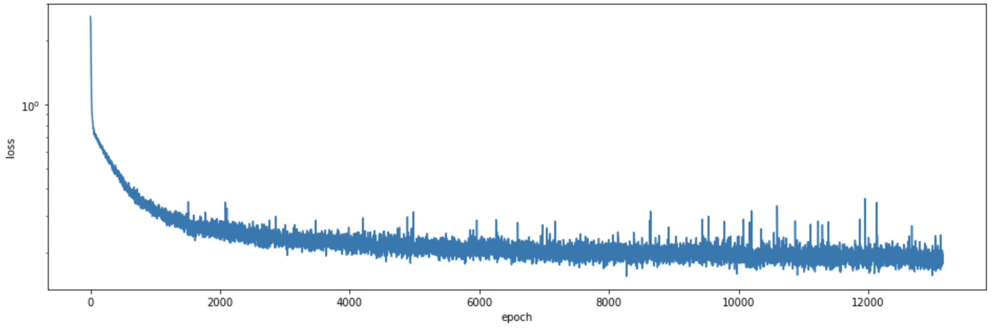

# RNN_MIDI_Composer
Training a LSTM on Indonesian Folk Songs in MIDI format to compose a new MIDI music.

## How to prepare your data
Convert your midi file into .csv using _Midicsv_[1], and put them in a folder, by default, in the `dataset` folder. 

## How to train model
Set your desired configuration in `train.py` then run
> python train.py

You can visualize the model performance using the `Music Composer.ipynb` notebook while training.

Note: The program will keep running unless you interrupt it with `ctrl+C`.

## How to compose music
Use the `Music Composer.ipynb` notebook. Load the model, then set your desired configuration.

In this example, `mymusic.csv` is generated. Use _Midicsv_[1] to convert it back to midi file, and you can open it with common midi player pr you can try _MidiEditor_[2]

## Sample Result
I have done some preprocessing on a list of Indonesia folk songs in midi format[3] and it results in all those .csv files in the `dataset` folder. The trained model is in the `model` folder, and the music it generates is in the `sample` folder.

Here is the Loss history

Note: You does not have to push the Loss to minimum to generate a good music.

## References
- http://www.fourmilab.ch/webtools/midicsv/
- https://www.midieditor.org
- https://midialdo.blogspot.com/2017/12/download-kumpulan-midi-lagu-lagu-daerah.html

